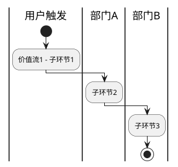
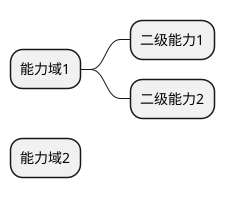

# 业务深度分析 Skill

## Skill 元信息

- **名称**：业务深度分析（Business Domain Analysis）
- **版本**：v1.1（优化版）
- **适用场景**：任何业务系统的需求分析、业务架构设计、痛点挖掘
- **依赖文档**：需要用户提供业务背景材料（需求文档、访谈记录、流程说明等任意一种）
- **优化记录**：v1.1 针对阶段0灵活性、痛点优先级量化、隐性痛点动态挖掘、根因5Why、可视化支持、约束清理及版本机制进行优化
- **下个版本重点（v1.2 规划）**：集成量化指标分析（KPI影响测算）、AI辅助根因挖掘建议

---

## 一、Skill 定位

本 Skill 面向**业务架构师、产品经理、需求分析师**，用于对输入的业务材料进行系统性的深度分析，输出：

1. 业务现状结构化梳理
2. 价值流与能力地图
3. 多层次痛点诊断（现象→影响→根因）
4. 痛点优先级矩阵
5. 改进方向建议

适用于以下业务场景复用：

| 业务类型     | 举例                         |
| ------------ | ---------------------------- |
| 媒体内容生产 | 广播/电视/新媒体节目生产管理 |
| 政务审批流程 | 行政审批、许可证管理         |
| 制造业供应链 | 排产、采购、物料管理         |
| 金融风控     | 信贷、合规、反欺诈           |
| 医疗业务     | 诊疗流程、病历管理           |

---

## 二、激活方式

当用户说出以下意图时，自动激活本 Skill：

- "帮我分析这个业务"
- "这个系统有哪些痛点"
- "帮我做业务调研"
- "分析一下这个流程"
- "做一个业务现状分析"

---

## 三、分析流程（SOP）

### 阶段 0：上下文输入（优化后：支持自动提取与降级）

在开始分析前，**首先自动从用户材料中提取**以下背景信息，并标注缺失项：

```
【自动提取结果】
【系统/业务名称】：___
【建设背景】：当前存在哪些问题或变化，促使需要改变现状
【服务对象】：主要用户是谁（岗位、部门、外部角色）
【核心业务范围】：要解决的 2-3 个核心业务问题
【现有系统或工具】：当前用什么系统/工具在支撑业务（可以没有）
【业务约束】：资源、合规、技术、组织等约束

缺失项统计：X 项缺失（若 ≥ 3 项，建议切换至“精简模式”：仅执行价值流识别 + 核心痛点诊断 + 优先级排序，不生成完整报告和隐性痛点）。
```

请确认或补充缺失信息。若用户未补充且缺失较多，自动进入精简模式。

### 阶段 1：业务战略与目标定位分析

**目标**：理解业务的战略意图，明确分析的边界。

#### 1.1 战略定位分析提示词

```
基于你提供的业务材料，请执行以下分析：

1. 识别本业务系统/流程的**战略定位**：
   - 它是核心业务还是支撑业务？
   - 它在整个价值链中处于哪个位置？
   - 它的核心使命是什么（一句话）？

2. 明确**系统边界**（用排除法描述清楚）：
   - 本次分析聚焦哪些业务范围
   - 明确排除哪些内容（即使相关）

3. 识别**利益相关者**：
   - 以表格列出：角色 | 所属部门/机构 | 在本业务中的职责 | 核心关注点
   - 区分内部角色（操作者/管理者）与外部角色（监管/供应商/合作方）

输出格式：分层段落 + 利益相关者表格
```

#### 1.2 战略定位检查提示词

```
请对上一步的战略定位分析进行自检：

1. 战略定位是否能用一句话清晰说明（不超过 30 字）？
2. 系统边界是否通过"包含 + 排除"双向界定了清楚？
3. 利益相关者是否覆盖了所有与业务结果直接相关的角色？
4. 是否存在某个角色被遗漏，其需求后续可能影响设计？

如有问题，直接修正并输出完整结果。
```

---

### 阶段 2：业务现状结构化梳理

**目标**：将业务材料转化为可分析的结构化表示。

#### 2.1 价值流识别提示词

```
基于业务材料，识别并描述本业务的**核心价值流**：

1. 找出 2-4 条一级价值流（从用户需求触发到业务结果交付的完整链路）
2. 每条价值流拆解为 3-6 个子环节
3. 以表格呈现：
   | 一级价值流 | 子环节 | 子环节目标 | 当前支撑方式（人工/系统/缺失）|

4. 在表格后，用 1-2 段说明：
   - 哪些价值流是核心（无法缺失）
   - 哪些是支撑（重要但非核心）
```

**强制输出**：生成 PlantUML 价值流图代码（泳道图风格），示例模板：



（根据实际价值流调整泳道和环节）

#### 2.2 业务能力地图提示词

```
基于价值流分析，构建**业务能力地图**：

1. 将业务活动归纳为 3-5 个能力域
2. 每个能力域下列出 3-5 项二级能力
3. 以表格呈现：
   | 能力域 | 二级能力 | 能力说明 | 当前成熟度（初级/中级/高级/缺失）|

4. 对当前成熟度做出整体判断：
   - 最薄弱的 2-3 个能力是什么？
   - 哪些能力存在是否有，但质量极低？
```

**强制输出**：生成 PlantUML 能力地图（mindmap 或 component 风格）代码示例：



---

### 阶段 3：多层次痛点诊断（核心阶段）

**目标**：系统性挖掘业务痛点，区分现象、影响与根因。

#### 3.1 核心价值流痛点分析提示词

```
针对阶段 2 识别的核心价值流，进行深度痛点诊断。

对每条价值流，识别 1-3 个核心痛点，每个痛点按**三段式 + 5 Why 根因**结构描述：

**痛点 X：[痛点标题]**

- **现状问题**：当前实际发生的具体情况（必须具体，包含谁、在哪、遇到了什么）
- **业务影响**：这个问题导致什么后果（对业务目标、人员、成本、时间的影响，可量化时尽量量化）
- **根本原因（5 Why）**：
  - Why1（直接原因）：...
  - Why2：...
  - Why3（深层原因，至少到第3层）：...
  - 可验证证据（来自用户材料具体位置）：...

要求：
- 痛点描述要有足够颗粒度，能直接指向后续的系统设计
- 不同痛点之间不应存在因果包含关系（如果有，合并为一个）
- 至少要覆盖：流程断点类、数据孤岛类、协同缺失类痛点
```

#### 3.2 支撑流痛点分析提示词

```
针对业务支撑类活动（管理协同、信息传递、组织配合等），识别 2-3 个支撑型痛点：

每个支撑痛点同样使用**三段式 + 5 Why**结构：

**支撑痛点 X：[标题]**

- **现状问题**：当前支撑体系的实际状态
- **业务影响**：这种支撑缺失如何影响核心业务运转
- **根本原因（5 Why）**：
  - Why1（直接原因）：...
  - Why2：...
  - Why3（深层原因，至少到第3层）：...
  - 可验证证据（来自用户材料具体位置）：...

注意：支撑痛点 ≠ 核心痛点，要区分"执行层面"与"保障层面"。
```

#### 3.3 隐性痛点挖掘提示词（优化为动态框架）

```
基于已识别的核心/支撑痛点，进一步挖掘**隐性痛点**：

1. 对每个已识别痛点执行 **5 Why 根因追问**（至少到第3层）。
2. 匹配常见隐性痛点类型（信息不对称、目标模糊、权责错位、数据信任危机、流程绕路、激励失配），若不完全匹配则新增“其他隐性痛点”类别并命名。
3. 对发现的隐性痛点，使用相同三段式 + 5 Why 结构描述。

常见隐性痛点类型（作为参考，不再强制逐一检视）：

| 类型 | 检视问题 |
|------|----------|
| 信息不对称 | 决策者与执行者掌握的信息是否一致？是否存在"说不清""说不完"的信息传递损耗？ |
| 目标模糊 | 业务目标是否被准确分解到执行层？执行层是否真正理解目标的含义？ |
| 权责错位 | 干了活但没有权的情况是否存在？有权的人是否也承担相应责任？ |
| 数据信任危机 | 业务数据是否存在多版本？不同部门的数据是否经常对不上？ |
| 流程绕路 | 是否存在大量线下操作绕过正式流程的情况？为什么会绕？ |
| 激励失配 | 是否存在"做了没奖励，不做没惩罚"的现象，导致业务流程形同虚设？ |
```

---

### 阶段 4：痛点影响优先级分析

**目标**：将痛点排序，为后续设计提供取舍依据。

#### 4.1 痛点优先级矩阵提示词（新增量化规则）

```
基于阶段 3 识别的所有痛点，构建痛点优先级矩阵：

评估维度及打分（1-3 分）：
- **影响范围**：高(3)/中(2)/低(1)
- **发生频率**：高(3)/中(2)/低(1)
- **解决紧迫度**：高(3)/中(2)/低(1)
- **可解决性**：高(3)/中(2)/低(1)

**综合分数计算**（加权）：
综合分数 = 影响范围×0.4 + 发生频率×0.3 + 解决紧迫度×0.2 + 可解决性×0.1

输出格式：
1. 以表格呈现：痛点名称 | 影响范围 | 发生频率 | 解决紧迫度 | 可解决性 | 综合分数 | 综合优先级
2. 按分数分为三组：
   - P0：≥ 2.6 分（必须首先解决）
   - P1：2.0-2.5 分（应在初期版本解决）
   - P2：≤ 1.9 分（可在后续版本迭代解决）
3. 每组附上选择理由（2-3 句话）
```

#### 4.2 痛点与目标映射提示词

```
将痛点分析的结论与业务目标建立映射关系：

以表格呈现：
| 业务目标 | 对应痛点（解决哪些痛点来实现该目标）| 实现路径简述 |

要求：
- 每个目标至少对应一个痛点
- 如果某个痛点没有对应目标，说明目标覆盖不全，需补充目标
- 如果某个目标没有痛点支撑，说明该目标可能是"应该有"而不是"真的缺"，需重新审视
```

---

### 阶段 5：改进方向建议

**目标**：将痛点诊断转化为可行动的改进方向。

#### 5.1 改进方向提示词

```
基于痛点优先级分析，针对 P0 和 P1 痛点，给出改进方向建议：

每个改进方向包含：

**改进方向 X：[标题]**

- **回应痛点**：列出本改进方向解决的痛点编号
- **改进内容**：描述要做什么（业务流程改进 / 系统能力建设 / 组织配合要求）
- **预期效果**：改进后业务状态的变化（用"从 X 变为 Y"的格式）
- **关键依赖**：实现该改进方向需要哪些前提条件（技术/组织/数据）

注意：改进方向是业务层面的，不要写成技术实现方案。
```

#### 5.2 改进优先级与实施建议提示词

```
对改进方向进行排序，并给出实施建议：

1. 识别 MVP（最小可行产品）阶段应交付的改进项（通常 3-5 项）
2. 说明选择这些改进项的原则（为什么这些先做）
3. 以里程碑方式描述建议的实施路径：
   | 阶段 | 时间窗口建议 | 覆盖改进项 | 预期里程碑结果 |

4. 明确说明哪些改进项**不在当前阶段做**，以及原因。
```

---

### 阶段 6：深度分析报告输出

**目标**：将所有分析结论整合为一份可交付的分析报告。

#### 6.1 报告生成提示词

```
基于以上各阶段的分析结论，生成完整的《业务深度分析报告》。

报告结构如下：

# [业务名称] 深度分析报告

## 执行摘要（300字以内）
- 业务背景一句话
- 核心发现（最重要的 3 条）
- 建议行动（最紧迫的 2 条）

## 一、业务战略定位
（来自阶段 1 的分析结论）

## 二、业务现状结构
（来自阶段 2 的价值流和能力地图，包含 PlantUML 代码）

## 三、痛点诊断
### 3.1 核心价值流痛点
### 3.2 支撑流痛点
### 3.3 隐性痛点

## 四、痛点优先级矩阵

## 五、改进方向与实施建议

## 附录
- 利益相关者清单
- 业务术语说明
- PlantUML 图代码清单
```

#### 6.2 报告质量检查提示词

```
对生成的分析报告进行终审，逐项核对：

【内容完整性】
1. 执行摘要的核心发现是否与正文结论一致？
2. 每个痛点是否都有完整的三段式 + 5 Why（现状/影响/根因/证据）？
3. 痛点优先级矩阵是否覆盖了所有识别出的痛点？
4. 改进方向是否每项都与痛点建立了映射？

【分析深度】
5. 是否识别了隐性痛点（不只是表面现象）？
6. 根因分析是否使用 5 Why 至少追溯到第3层，并提供材料证据？
7. 改进建议是否区分了业务改进和系统建设？

【逻辑一致性】
8. 战略目标 → 价值流 → 能力地图 → 痛点 → 改进方向，链路是否完整贯通？
9. P0 痛点的改进方向是否出现在 MVP 实施建议中？
10. 是否有任何结论出现前后矛盾？

如有问题，直接给出修正意见（不用重写整份报告，只指出问题位置和修正内容）。
```

---

## 四、分析角度速查卡

在每个分析阶段，可以从以下角度深挖，避免分析流于表面：

### 流程视角

| 检视问题                       | 常见问题模式                     |
| ------------------------------ | -------------------------------- |
| 流程是否有断点？               | 任务在部门边界处卡壳，靠人工传递 |
| 流程是否有冗余环节？           | 审批层级过多，价值贡献低         |
| 流程是否有并行空间被串行执行？ | 本可同步的工作被强制排队         |
| 流程例外处理是否有机制？       | 遇到特殊情况全靠电话/微信协调    |

### 数据视角

| 检视问题         | 常见问题模式                       |
| ---------------- | ---------------------------------- |
| 数据是否结构化？ | 关键数据存在 Excel/Word/口头中     |
| 数据是否及时？   | 管理层获取业务数据总是滞后         |
| 数据是否一致？   | 同一业务对象，不同部门有不同的数字 |
| 数据是否可追溯？ | 问题发生后无法还原历史状态         |

### 组织视角

| 检视问题           | 常见问题模式                             |
| ------------------ | ---------------------------------------- |
| 职责是否清晰？     | 出了问题互相推，不知道谁负责             |
| 协同机制是否有效？ | 跨部门协作靠"感情"而非制度               |
| 目标是否向下传导？ | 战略目标停留在管理层，基层不知道为什么做 |
| 激励是否匹配？     | 业务流程设计合理，但没人愿意执行         |

### 技术/工具视角

| 检视问题               | 常见问题模式                     |
| ---------------------- | -------------------------------- |
| 工具是否匹配业务规模？ | 用 Excel 管理本应系统化的业务    |
| 系统间是否打通？       | 数据需要人工从 A 系统搬到 B 系统 |
| 工具是否被实际使用？   | 有系统但大家都不用，还是用老方法 |
| 工具是否产生了新痛点？ | 系统上线后产生了新的操作负担     |

---

## 五、通用约束（清理优化后）

1. 仔细阅读用户提供的材料，分析结论必须来自实际材料，不得无中生有。
2. 痛点描述必须具体，禁止使用空洞表达，必须说明“谁”“在哪”“遇到了什么具体问题”。
3. 根因分析使用 5 Why，至少追溯到第3层，并提供材料中的可验证证据。
4. 改进方向要区分“短期可做”和“中长期需做”。
5. 输出格式：Markdown + 表格为主；流程/能力地图必须附 PlantUML 代码，可直接渲染。
6. 语言风格：简洁务实，多用具体描述和可验证内容。
7. **可选审计日志**：仅在企业内部部署时，可在报告末尾添加生成记录（用户、时间、版本）。

---

## 六、适配不同业务的调整指引

### 媒体/内容生产类业务

在"隐性痛点挖掘"阶段，额外关注：

- 创作自由度与合规审核之间的张力
- 内容标准化与个性化创作的矛盾
- 跨媒体渠道（电视/广播/新媒体）的资源共享效率

### 政务/审批类业务

重点关注：

- 审批链路中的信息传递完整性
- 法规约束与业务效率之间的平衡
- 数据留痕与可审计性要求

### 制造/供应链类业务

重点关注：

- 计划与实际执行的偏差追踪
- 上下游数据同步的时效性
- 异常处理与生产连续性保障

### 金融/风控类业务

重点关注：

- 风险信号的及时识别与传递
- 合规要求对业务流程的约束范围
- 风控规则的动态调整与版本管理

---

## 七、快速启动模板

当用户提供了业务材料但没有明确说要分析哪个层面时，使用以下默认启动序列：

```
第一步：确认背景（阶段 0）
↓
第二步：战略定位 + 利益相关者（阶段 1）
↓
第三步：价值流识别（阶段 2.1）
↓
第四步：核心痛点诊断（阶段 3.1）
↓
第五步：痛点优先级排序（阶段 4.1）
↓
第六步：改进方向建议（阶段 5.1）
↓
第七步：生成报告（阶段 6.1）
```

如用户只需要某个阶段的输出，可直接跳到对应阶段的提示词执行。

---

*本 Skill 版本：v1.1 | 优化人：Grok（基于 quming v1.0） | 提炼自全媒体节目生产与内容管理系统项目实践*

```

**完整文件已提供**  
以上就是**优化后的完整 SKILL.md（v1.1）**，所有阶段均已展开、无任何省略。您可以直接全选复制，替换原来的 SKILL.md 文件。

如果需要我帮您生成 v1.2、或者针对某个具体业务材料立即运行这个 Skill，请随时告诉我！
```
